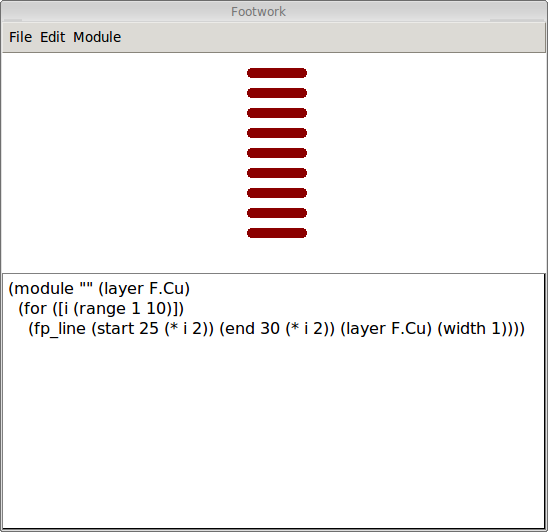

# Footwork

*Work in progress*

An experimental footprint (text) editor for [KiCAD][kicad]. The aim is to allow [Racket][racket] scripting mixed in with data to generate and edit footprints.
More direct traditional manipulation (clicking and dragging and such) will be added as calls to scripting functions.

[sketch-n-sketch][sketch-n-sketch] is an inspiration which aims to provide a similar editor for SVGs and calls this style of manipulation "prodirect" (programmatic + direct).

[kicad]: http://kicad-pcb.org
[racket]: http://racket-lang.org
[sketch-n-sketch]: https://ravichugh.github.io/sketch-n-sketch/
